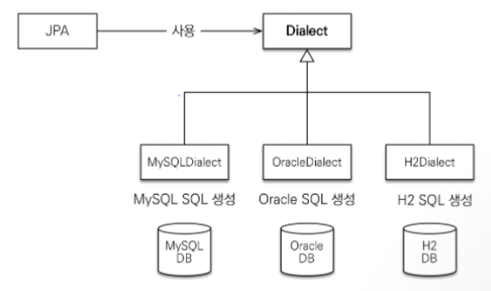

# JPA

# 1. JPA 개요

### 1.1 JPA

- Java Persistence API
- 자바 진영의 ORM(Object Relational Mapping) 기술 표준으로 ORM 기술을 사용하기 위한 표준 인터페이스의 모음입니다.
- ORM은 자바 객체와 DB테이블을 매핑하고 자바 객체간의 관계를 토대로 SQL을 생성 및 실행할 수 있으며 대중적인 언어에는 대부분 ORM 기술이 존재합니다.
- JPA 2.1 기준 표준 명세를 구현한 구현체들(Hibernate, EclipseLink, DataNucleus) 중 대부분 Hibernate를 사용하므로 JPA를 활용하기 위해서는 Hibernate를 사용합니다.
- 하이버네이트(Hibernate)는 자바를 위한 오픈소스 객체-관계 매핑 프레임워크를 제공합니다. 버전 3.2와 그 이후 버전에서는 JPA를 위한 구현을 제공합니다.

### 1.2 JPA 역사

- EJB(Enterprise JavaBeans) : 1997년 IBM에서 개발된 뒤, 1999년에 Sun Microsystems로 인수된 자바 표준 기술입니다. 지저분한 코드와 느리고 제대로 동작하지도 않는 결함이 많은 기술이었습니다.
- Gavin King이 EJB 컨테이너에 의존하지 않는 ORM 프레임워크인 Hibernate를 만들게 되고 오픈소스화가 되어 EJB는 사라지게 되었습니다.
- 이후 Java와 GavinKing이 같이 Java 표준을 만들게 되었고 2006년에 JPA 1.0이라는 JPA의 초기버전이 나온 이후 현재까지 JPA는 2.1버전(2013년 4월 22일 배포)까지 사용되고 있습니다.

### 1.3 JPA 특징

- 영속 컨텍스트 (Persistence Context)
    - 영속 컨텍스트를 이용해 엔티티를 보관하고 관리합니다.
    - 엔티티는 영속 컨텍스트 내에서 각자의 생명주기를 가집니다.
- 엔티티 (Entity)
    - 엔티티는 JPA가 관리하는 객체로 데이터베이스 테이블과 매핑되어 데이터를 저장하고 조회하는데 사용됩니다.
    - 객체지향적으로 설계되어, 데이터베이스 테이블과 1:1로 매핑됩니다.
    - 엔티티는 식별자(기본키)를 통해 데이터베이스에서 고유하게 식별됩니다.

### 1.4 JPA 장점

- 자바는 객체 지향이고, 데이터베이스는 관계 지향입니다. 서로 다른 이 두 개의 패러다임의 불일치를 해소해 주는 기술이 JPA입니다.
- SQL 중심이 아닌 객체 지향 중심의 개발이 가능합니다.
- 개발자가 SQL을 직접 작성하지 않아도 자동으로 SQL문을 작성해서 실행하기 때문에 개발 생산성이 높아집니다.
- 데이터베이스의 종류에 따라 Dialect를 제공하여 개발자 대신 데이터베이스의 종류에 맞는 SQL을 작성합니다.
- 캐시를 활용하는 성능 최적화로 인해 트랜잭션을 처리하는 시간이 많이 단축됩니다.
- JPA는 기본적으로 SQL을 작성해 주는 API를 제공하지만, 개발자가 원하면 직접 SQL을 작성할 수도 있습니다.
    
    
    

### 1.5 JPA 단점

- 개발자가 JPA에 대한 이해도가 부족하면 성능이 떨어지는 SQL이 작성될 우려가 있습니다.
- 컬렉션 필드를 사용하거나 연관 관계 매핑을 사용할 때 복잡하고 불필요한 SQL이 생성되어 성능이 더 떨어질 수 있습니다.
- 복잡한 SQL의 경우 순수 JPA로 만드는 것이 불가능하여 추가 라이브러리를 활용해야 하는 경우가 있습니다.

### 1.6 MyBatis와 JPA

- MyBatis는 SQL Mapping Framework입니다. Java 메소드와 SQL 간의 매핑을 통해 SQL을 실행하는 방식입니다. Java 코드와 SQL을 별도로 분리하여 관리하기 때문에 SQL이 Java 코드 내에 들어가 있는 JDBC 방식에 비해 개발자들이 코드를 유지 보수하기 좋습니다.
- JPA는 데이터베이스 데이터와 Java 객체를 매핑하는 기술입니다. SQL 작성을 스스로 하기 때문에 MyBatis보다 한 단계 더 자동화되어 더 편리한 개발 환경을 제공합니다.
- 우리나라의 경우 정부의 표준 프레임워크인 “전자정부 프레임워크”가 MyBatis를 사용하기 때문에 전통적으로 MyBatis를 더 많이 사용합니다.
- 최근에는 인터넷 서비스 기업과 스타트업 기업을 중심으로 JPA 기술을 사용하는 경우가 늘고 있습니다.
- MyBatis 장단점
    - 장점 : 우선 배우기 쉽습니다. SQL을 직접 제어할 수 있습니다. 동적 쿼리와 같은 복잡한 쿼리도 비교적 쉽게 작성할 수 있습니다.
    - 단점 : CRUD 같은 기본적인 코드에서는 반복적인 수작업이 필요하고, 데이터베이스에 따라 SQL이 달라지므로 데이터베이스에 종속적입니다.
- JPA 장단점
    - 장점 : 특정 데이터베이스에 종속되지 않습니다. SQL을 만들어 주기 때문에 생산성이 높아지고 표준화 된 인터페이스 제공되므로 일관된 방식으로 개발을 할 수 있습니다.
    - 단점 : 다양한 어노테이션과 로딩 이슈 및 영속성 전이 등이 해결 방법을 익혀야 하므로 러닝 커브가 높습니다. 여러 테이블을 Join하는 복잡한 쿼리를 만드는 경우 정확한 결과를 얻기가 힘들 수 있습니다. 또한 자동으로 생성되는 조회 SQL의 경우 성능이 떨어질 수 있습니다.
- 결론
    - JPA가 무조건 좋은 것은 아닙니다.
    - 모든 것을 JPA로 할 필요도 없으며, 그런다고 성능이 더 좋다는 보장도 없습니다.
    - 데이터 변경 작업(INSERT, UPDATE, DELETE)의 경우 JPA가 MyBatis 보다 더 높은 생산성을 제공할 수 있습니다.
    - 복잡한 조회 작업(JOIN, SUBQUERY 등)의 경우 MyBatis를 사용하는 것이 JPA 보다 유리한 경우가 많습니다.
    - 따라서, 두 기술을 혼용하여 사용하는 것도 충분히 고려해 볼 수 있습니다.

# 2. JPA 동작 방식

### 2.1 JPA 기본 동작 방식

- Java 애플리케이션과 JDBC 사이에서 동작하며 내부적으로 JDBC API를 활용합니다.
- JPA는 엔티티를 저장하는 환경인 영속 컨텍스트(Persistence Context)를 통해 엔티티를 보관하고 관리합니다.
    - 엔티티란?
        
        @Entity를 Annotation이 추가된 클래스로 데이터베이스 테이블과 매핑되는 클래스를 의미합니다.
        

### 2.2 영속 컨텍스트

- Persistence Context
- 영속 컨텍스트는 엔티티를 관리하는 공간으로 엔티티 매니저가 관리합니다.
- 엔티티 매니저가 생성되면 해당 엔티티 매니저가 관리하는 하나의 영속 컨텍스트가 생성됩니다.

### 2.3 영속 컨텍스트 생명주기

- 엔티티는 4가지의 생명주기를 가집니다.

- 엔티티의 생명주기

| **상태** | **설명** | **특징** | **주요 메서드** |
| --- | --- | --- | --- |
| **비영속** New/Transient | 영속성 컨텍스트와 전혀 관련이 없는 상태 | - 순수한 객체 상태 - JPA와 무관한 일반 Java 객체 - 1차 캐시에 포함되지 않음 - 변경감지 기능 적용 안 됨 | **`new Entity()`** |
| **영속** Managed | 영속성 컨텍스트에 의해 관리되는 상태 | - 1차 캐시에 저장됨 - 변경감지(Dirty Checking) 적용 - 쓰기 지연 SQL 저장소에 등록 - 지연 로딩 가능 |  **`em.persist()`** **`em.find()`** **`JPQL 조회`** **`em.merge()`** |
| **준영속** Detached | 영속성 컨텍스트에 저장되었다가 분리된 상태 | - 영속 컨텍스트가 더 이상 관리하지 않음 - 변경감지 불가 - 지연 로딩 불가 - 1차 캐시에서 제거됨 | **`em.detach()`** **`em.clear()`** **`em.close()`** |
| **삭제** Removed | 삭제가 예정된 상태 | - 영속 컨텍스트와 데이터베이스에서 삭제 예정 - 트랜잭션 커밋 시 DELETE SQL 실행 - 영속 컨텍스트에서 제거됨 | **`em.remove()`** |

### 2.4 영속 컨텍스트의 엔티티 관리 방식

- 1차 캐시
    - 영속 컨텍스트 내부에 Map으로 관리되는 캐시이며, 이 곳에 저장된 엔티티는 곧바로 호출할 수 있으므로 조회 성능이 향상됩니다.
    - Map의 key는 @Id이며, value는 엔티티 객체입니다.
- 트랜잭션을 지원하는 쓰기 지연
    - Transactional write-behind
    - 영속 컨텍스트에 새로운 엔티티가 등록되면 엔티티 매니저는 트랜잭션을 커밋하기 이전까지는 엔티티를 데이터베이스에 저장하지 않습니다.
    - 대신 쓰기 지연 SQL 저장소에 INSERT 쿼리를 쌓아두고, 커밋 시 저장해 둔 쿼리를 데이터베이스로 보내는데 이를 트랜잭션을 지원하는 쓰기 지연이라고 합니다.
- 플러시
    - flush()
    - 영속 컨텍스트의 변경 내용을 데이터베이스에 반영하는 것을 플러시라고 합니다.
    - 플러시를 하는 경우
        - em.flush() 직접 호출
        - 트랜잭션 커밋 시 자동 호출
        - JPQL 쿼리 실행 시 자동 호출

### 2.5 변경 감지

- Dirty Checking
- Dirty Checking은 JPA의 핵심 기능 중 하나로, 영속 컨텍스트가 엔티티의 변경사항을 자동으로 감지하여 데이터베이스에 반영하는 메커니즘입니다.
- 여기서 Dirty는 "엔티티가 변경된 상태"를 의미하며, JPA가 엔티티의 변경사항을 자동으로 감지해서 UPDATE 쿼리를 생성하는 기능입니다.
- JPA는 엔티티를 최초 조회할 때 현재 상태를 스냅샷으로 저장해 두는데, 트랜잭션 커밋 시점에 스냅샷과 현재 상태를 비교하여 변경사항이 있으면 UPDATE 쿼리를 자동으로 생성합니다.
- 주의사항
    - 영속 상태에서만 동작 : 준영속이나 비영속 엔티티는 변경감지 대상이 아닙니다.
    - @Transactional 필수 : 트랜잭션 없이는 동작하지 않습니다.
    - 성능 고려 : 불필요한 UPDATE 방지를 위해 @DynamicUpdate 고려할 수 있습니다.